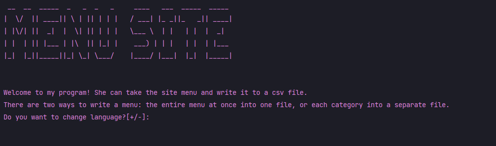
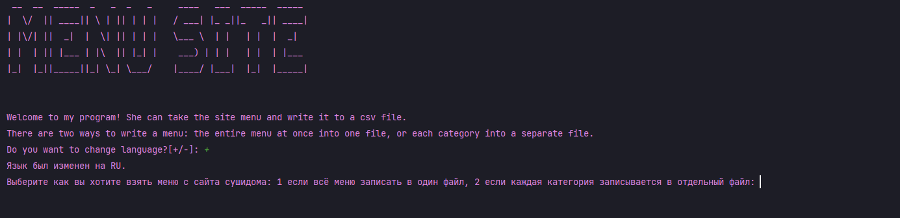
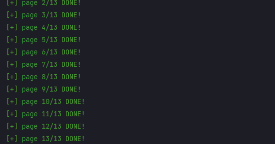
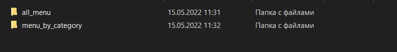
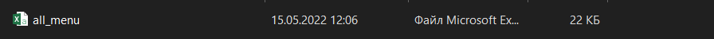
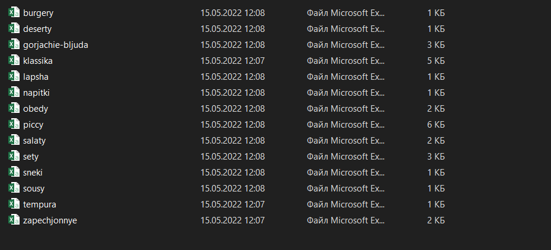
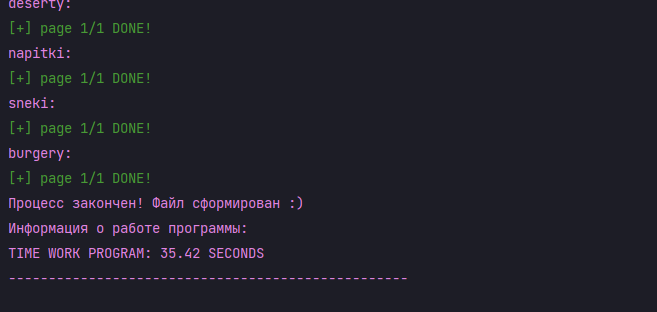

# Scraping site sushidom

Language:

* [RU](#ru_doc)
* [EN](#en_doc)

### Документация

***

Перед вами представлен парсер сайта sushidom.
В качестве интерфейса используется консоль.
При запуске программы перед вами появляется вводная информация. В начале стоит выбор: изменить язык на
русский или оставить английский,
так как по умолчанию он является основным языком.

Следующий выбор касается способа парсинга. Есть два способа: спарсить всё меню в
один файл или каждую категорию в отдельный файл.

В процессе парсинга показываются выполненные стадии парсинга страницы.

Сформированные файлы сохраняются
в папку data, а внутри папки data в папку соответствующую выбраному парсеру.

В конце парсинга программа выводит информацию, что всё успешно спарсилось
и также показывает время за которое спарсился сайт.

Используемые библиотеки:

* requests;
* BeautifulSoup;
* csv;
* os;
* art;
* fake_useragent;
* time.

__Спасибо за внимание!__

### Documentation

***

Here is a site parser. The console is used as an interface.
When you start the program, introductory information appears
in front of you. At the beginning, you are faced with a choice:
change the language to Russian or leave English, since it is the
main language by default.

The next choice concerns the parsing method .
There are two ways: parse the entire menu into one file or each category
into a separate file.

During the parsing process, the completed stages of parsing the page are
shown.

The generated files are saved in a folder, and inside the folder
in a folder corresponding to the selected parser.

At the end of parsing,
the program displays information that everything was successfully parsed
and also shows the time for which the site was parsed.

Libraries used:

* requests;
* BeautifulSoup;
* csv;
* os;
* art;
* fake_useragent;
* time.

__Thank you for your attention!__

[Up | Вверх](#anchor)